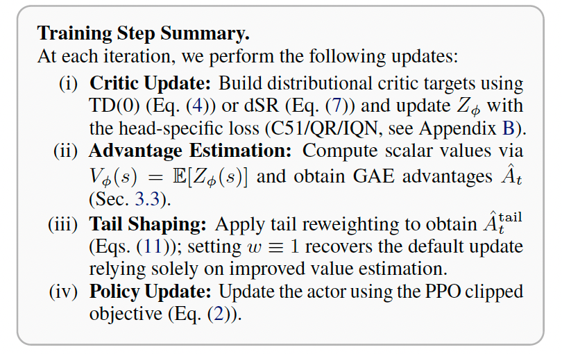
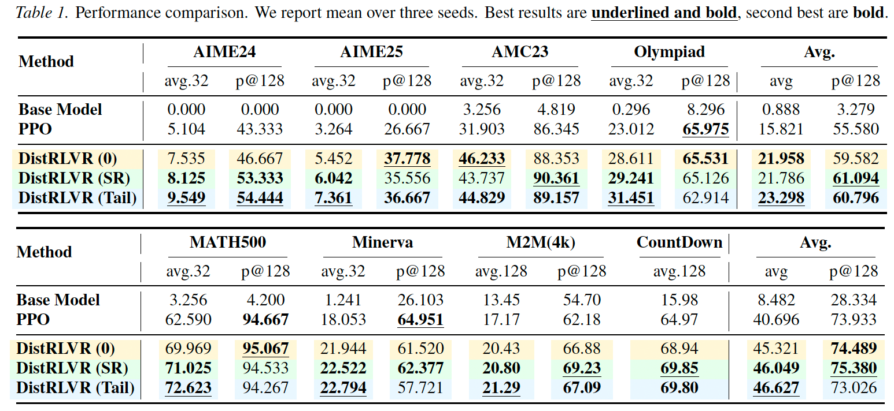
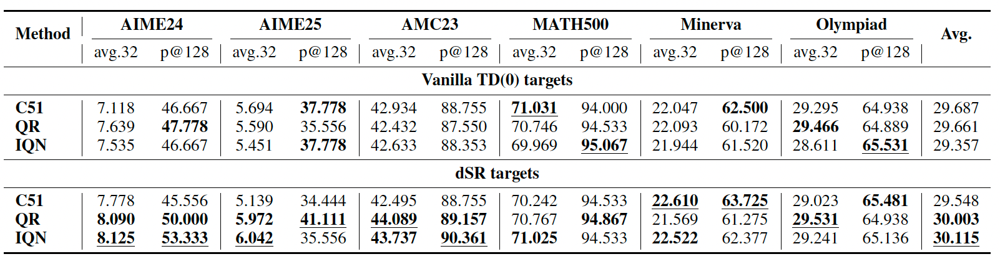

# DistRLVR — Distributional RLVR for LLM Post‑Training

This repository implements **DistRLVR**, a distributional reinforcement learning framework for **RL with verifiable rewards (RLVR)** in LLM post‑training, built on top of **VeRL** (Ray + FSDP + vLLM rollout).

DistRLVR is designed for the common RLVR regime where rewards are **terminal / near-binary** and **credit assignment spans long token sequences**, leading to **heavy‑tailed and highly stochastic prompt‑conditional return distributions**.

---

## What’s in the paper

DistRLVR replaces mean‑only value baselines with a **token-level distributional critic** and provides stable targets and PPO-compatible shaping:

1. **Token-level distributional critic**  
   Learn a return distribution $Z_\phi(s_t)$ instead of only $V_\phi(s_t)=\mathbb{E}[Z_\phi(s_t)]$.  
   Supported parameterizations:
   - **C51** (categorical atoms + projection)
   - **QR** (fixed quantile regression)
   - **IQN** (implicit quantile network)

2. **Two distributional targets**
   - **TD(0)** target
   - **Dual Sample-Replacement (dSR)** targets  
     Stabilize distribution learning under terminal-sparse rewards by building multiple multi-step targets via a **Sample Replacement** backward sweep:
      - *K* rollouts per prompt (rollout diversity)
      - *M* SR targets per token (supervision diversity)

3. **Tail-aware advantage shaping**  
   Use learned return distributions to construct **tail-sensitive weights** (upper/lower tail), and apply **stop‑grad gated reweighting** to advantages while preserving stable update scales.



---

## Repository features

- **VeRL training stack**: Ray orchestration, FSDP/FSDP2 support, vLLM rollout, dynamic micro‑batching.
- **Distributional critics**: C51 / QR / IQN value heads integrated into the critic worker.
- **dSR target construction**: distributional TD(0) targets and Sample‑Replacement targets (v3) as switchable options.
- **Tail / risk knobs**: risk functionals (e.g., CVaR upper/lower tails) implemented as PPO-compatible baseline / advantage shaping.
- **Scripts**: training scripts in `scripts/train/*` and evaluation helpers in `scripts/eval/*`.

---

## Results

### Overall performance



### Critic head comparison



---

## Quickstart

1. **Set up the environment**  
   Use `environment.yaml` to create the runtime environment, then make sure your CUDA/PyTorch stack matches your GPUs.

2. **Configure and run training**  
   Update the scripts under `scripts/train/` with your paths and hyperparameters, then run the target script.

   ```
   scripts/train/
     R1-qwen2.5-1.5b/
       ppo.sh
       grpo.sh
       DistRLVR_IQN.sh
       DistRLVR_QR.sh
       DistRLVR_C51.sh
       DistRLVR_IQN_risk_averse.sh
       DistRLVR_IQN_risk_seeking.sh
       DistRLVR_risk_tail.sh
       config.yaml
   ```

3. **Evaluate and collect results**  
   Use the helpers in `scripts/eval/` to run benchmarks and aggregate metrics.

---

## Acknowledgements

We thank and reference the following projects:
- POLARIS: https://github.com/ChenxinAn-fdu/POLARIS
- VeRL: https://github.com/verl-project/verl

---

## Citation

If you use this codebase in research, please cite the DistRLVR paper.

```bibtex
@article{distrlvr2026,
  title   = {Beyond Scalar Critics: A Distributional Perspective on Reinforcement Learning with Verifiable Rewards for LLMs},
  author  = {Anonymous},
  year    = {2026}
}
```